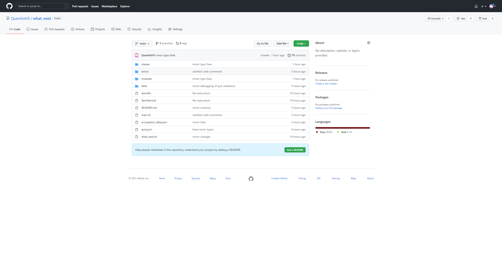
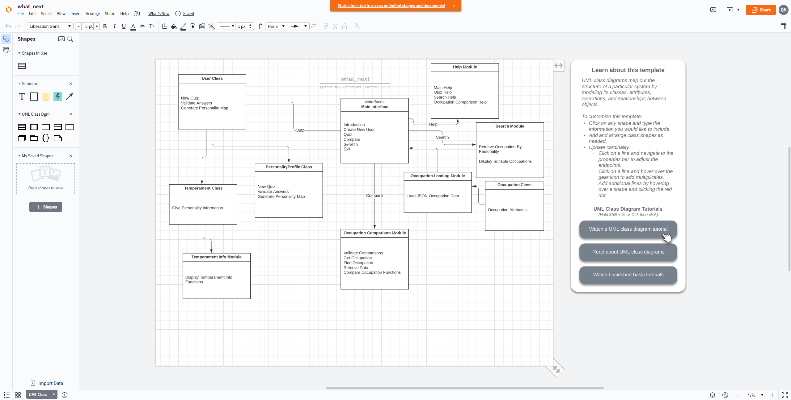
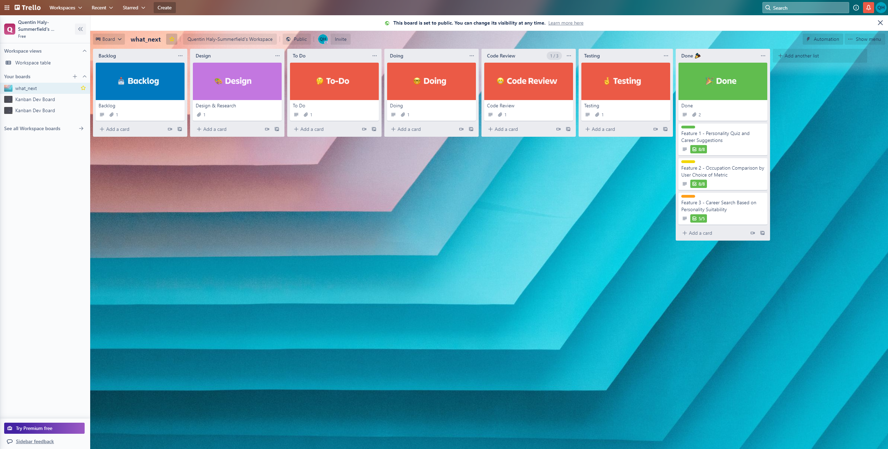

# Quentin Haly-Summerfield T1A3 – Terminal Application: What Next? 

## Links 

### GitHub repository:  

[GitHub](https://github.com/QuentinHS/what_next) 

 
### Trello board 

[Trello](https://trello.com/b/5C48U3Mw/whatnext) 

### Control flow diagram 

[Lucid](https://lucid.app/lucidchart/46d50ff0-0e75-4167-8351-5082aed02041/edit?viewport_loc=52%2C-131%2C2278%2C1417%2CHWEp-vi-RSFO&invitationId=inv_434f7d10-3688-4900-a55f-ac9b1215f663) 

### Screenshots

## Software Development Plan 

### Purpose and Scope 

#### Overview 

What Next is a terminal-based career suggestion, comparison and search application designed to assist users in exploring potential career opportunities Users’ can opt to take a take a personality quiz to generate a personality profile and relevant career suggestions, compare occupations by occupation salary, occupation size, growth, or the occupation’s vulnerability to automation, or search for occupations that are compatible with a given personality type. 

#### Problem 

Making career decisions is an inherently difficult decision, especially when there are seemingly limitless options available. The process of sifting through abundant amounts of data can make this process even more arduous and paralyzing. This application is designed to simplify a portion of the career research process, providing users with tailored career suggestions based on their personality type and relevant metrics by which they may compare or search for different occupations.   

#### Target Audience 
 
It is expected that this application will primarily appeal to high school students who wish to explore their career options prior to graduation. Such students might not be aware of all the possibilities available to them, or what types of occupations may suit a particular type of personality. They may also simply wish to learn more about the current status of a particular occupation. However, anyone that is looking for career suggestions or information, or even simply for a short, simple personality test, may also find a compelling reason to use this application.   

### Features 

#### Personality Quiz 

This application utilises a 70-question introspective self-report questionnaire that is roughly similar to the popular Myers-Briggs Type Indicator or Keirsey Temperament Sorter. This quiz requires only 'a)' or 'b)' answers, and completing the quiz results in a personality profile divided across four personality attributes – introversion/extraversion, sensing/intuition, thinking/feeling and judging/perceiving. For example, a user might be assigned an ‘ENFP’ (extraverted/intuitive/feeling/perceiving) personality type.  The resulting personality profile is used to generate one of sixteen temperament types - for example, the previous ‘ENFP’ would possess a 'Champion' temperament. This temperament will then be cross-referenced to occupations that may particularly suit a person of that particular temperament. Career suggestions are furthered filtered by metrics such as whether the occupation is of a sufficient size,  whether or not it is currently growing, and whether it faces the threat of automation in the near future.   

#### Comparison Tool 

The application also utilises a comparison tool by which users can directly compare two occupations across one of four different metrics: salary, occupation size, occupation growth, and how vulnerable the occupation is to automation. The salary metric will compare occupations by factors including typical minimum starting salary, average salary, and approximate 90th percentile salary. The occupation size metric will compare occupations based on the number of persons currently employed in that particular role in Australia. The occupation growth metric will compare occupations based on whether that occupation is currently growing in size, and, if so, by how much. Finally, the vulnerability metric will compare whether either occupation is currently at risk of automation in the near-to-medium future. Information is primary derived from government websites such as [JobOutlook](https://joboutlook.gov.au/), although other websites as [PayScale](https://www.payscale.com/) were also consulted.   

#### Search by Personality Type 

Finally, the application provides the ability for users to choose a personality type and search for occupations that may suit that particular personality type. For example, users can select “INTP” and will be given a list of occupations that are considered especially compatible for persons of that particular personality type. Unlike the suggestions provided by the first feature, these suggestions are unfiltered by any additional metrics such as salary or growth. The advantage of this feature is that users who already know their personality type and wish to take a different quiz can simply use this information as input rather than having to sit through an additional questionnaire.   

#### How to Use this Application 

Upon starting the application, you will be asked for your name, but you may remain anonymous if you wish. You will then be presented with a selection menu offering the choice of taking a personality quiz, comparing two occupations, searching occupations by personality type, seeing help information, or exiting the application. You can navigate these options with the keyboard arrow keys, and confirm selection with the ‘enter’ key.   

If you select the 'quiz' option, you will be taken to a 70 question quiz. Users may then type 'a' or 'b' on their keyboard to answer questions, or `-q` or `--quit` to return to the main menu. 
 
If you select the 'comparison' option, you will be asked to enter two occupations manually with your keyboard, one after the other. You can also type `-q` or `--quit` to exit back to the main menu. Upon choosing two professions, you will be presented with a selection menu navigated by the arrow keys, in which users may choose the metrics by which they want to compare the professions. Upon selecting a comparison option, you will be returned to the main menu. 

If you select the 'search' option,  you will be presented with a range of personality types, and asked to use the arrow keys to navigate the options. Choosing an option will display appropriate jobs for that personality type, at which time you will be returned to the main menu.   

#### Error Handling 

At certain points in this application, users are required to input data manually. To ensure data is valid, validation functions have been created. Entering invalid data will result in an error and the prompt to re-enter the input. Error handling has also been added for the process of loading json files.  

### Installation and Use 

#### Linux 

1. Clone this respository from GitHub or download this repository as a zip file, then navigate to the new directory. 

2. Run the command `bundle install` from within the src directory to install any necessary dependencies. 

3. To commence the application, you can run the included bash script with the command `./what_next.sh`. If you do not have execute permission, run the command `chmod +x what_next.sh`   

#### Windows 

1. Clone this repository from GitHub or download this github repository as a zip file, then navigate to the new directory. 

2. Run the command `bundle install` from within the src directory to install any necessary dependencies.  

3. Run the application from the source directory by typing `ruby main.rb`

### Dependencies 

This application utilises the Ruby programming language, which must be installed for it to run. Ruby may be installed [here](ruby-lang.org)   

Bundler has been used to manage dependencies. If you don’t already have bundler installed, you can use the command `gem install bundler`. Further instructions can be found [here](https://bundler.io/) 

The application also utilises the following Ruby dependencies which must be installed as Ruby gems: 

colorize ~> 0.8.1 

[Info](https://github.com/fazibear/colorize) 

json ~> 2.5 

[Info](https://rubygems.org/gems/json/versions/2.5.1)

tty-prompt ~> 0.23.0 

[Info](https://github.com/piotrmurach/tty-prompt) 

### Hardware Requirements 

There are minimal hardware requirements for this application. However, it is recommended that you run it on a Linux or macOS-based operating system, as certain dependencies such as tty-prompt may encounter bugs on Windows machines. If you do encounter problems, potential fixes may be found [here](https://github.com/piotrmurach/tty-prompt#ttyprompt-)

The included bash script will also not run on Windows-based machines, in which case the application must be run via the `main.rb` file in the src directory.  

 

 

 

 

 